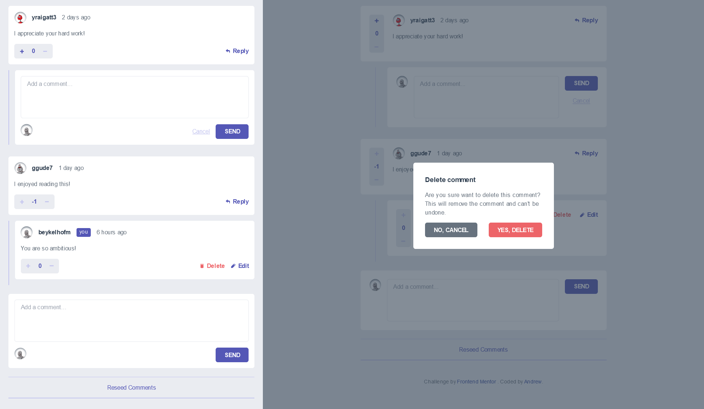

[](https://app.netlify.com/sites/frontend-mentor-interactive-comments-section/deploys)

# Frontend Mentor - Interactive comments section solution

This is a solution to the [Interactive comments section challenge on Frontend Mentor](https://www.frontendmentor.io/challenges/interactive-comments-section-iG1RugEG9). Frontend Mentor challenges help you improve your coding skills by building realistic projects.

## Table of contents

- [Frontend Mentor - Interactive comments section solution](#frontend-mentor---interactive-comments-section-solution)
  - [Table of contents](#table-of-contents)
  - [Overview](#overview)
    - [The challenge](#the-challenge)
    - [Screenshot](#screenshot)
    - [Links](#links)
    - [Developing](#developing)
      - [Clone](#clone)
      - [Develop](#develop)
      - [Build](#build)
  - [My process](#my-process)
    - [Built with](#built-with)
    - [What I learned](#what-i-learned)
  - [Author](#author)

## Overview

### The challenge

Users should be able to:

- View the optimal layout for the app depending on their device's screen size
- See hover states for all interactive elements on the page
- Create, Read, Update, and Delete comments and replies
- Upvote and downvote comments
- **Bonus**: If you're building a purely front-end project, use `localStorage` to save the current state in the browser that persists when the browser is refreshed.
- **Bonus**: Instead of using the `createdAt` strings from the `data.json` file, try using timestamps and dynamically track the time since the comment or reply was posted.

### Screenshot



### Links

- Solution URL: [Add solution URL here](https://your-solution-url.com)
- Live Site URL: [https://frontend-mentor-interactive-comments-section.netlify.app/](https://frontend-mentor-interactive-comments-section.netlify.app/) (Click "Reseed comments" link on the bottom of the website to start)

### Developing

#### Clone

```bash
git@github.com:ap2soft/frontend-mentor-interactive-comments-section.git
cd frontend-mentor-interactive-comments-section
npm install
```

#### Develop

```bash
npm run dev
```

#### Build

```bash
npm run build
```

## My process

### Built with

- Mobile-first workflow
- [React](https://reactjs.org/) - A JavaScript library for building user interfaces
- [Tailwind CSS](https://tailwindcss.com/) - A utility-first CSS framework
- [Vite](https://vitejs.dev/) - Next Generation Frontend Tooling (to build the project)
- [Netlify](https://netlify.com) - Webiste deployment

### What I learned

I used React for the first time here. I hope I did it alright.

## Author

- Website - [Andrew](https://ap2.dev)
- Twitter - [@andreich1980](https://www.twitter.com/andreich1980)
